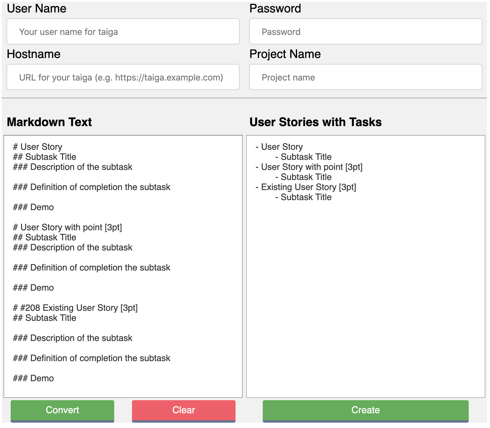
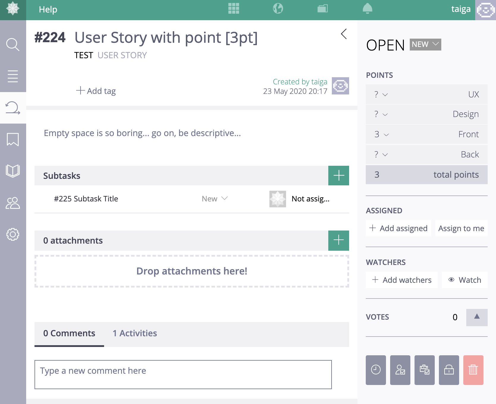

# md2taiga

A web application for creating user stories on Taiga.io from markdown text

## Getting Started

<!-- [Go to the md2taiga where I'm hosting.](http://md2taiga.dmti.net/) -->

You can run this app in your local environment.

``` shell
git clone git@github.com:d-matsui/md2taiga.git
cd md2taiga
python3 -m venv venv
. venv/bin/activate
pip install -r requirements.txt
source ./export.sh
flask run
```

## Screen-shots




